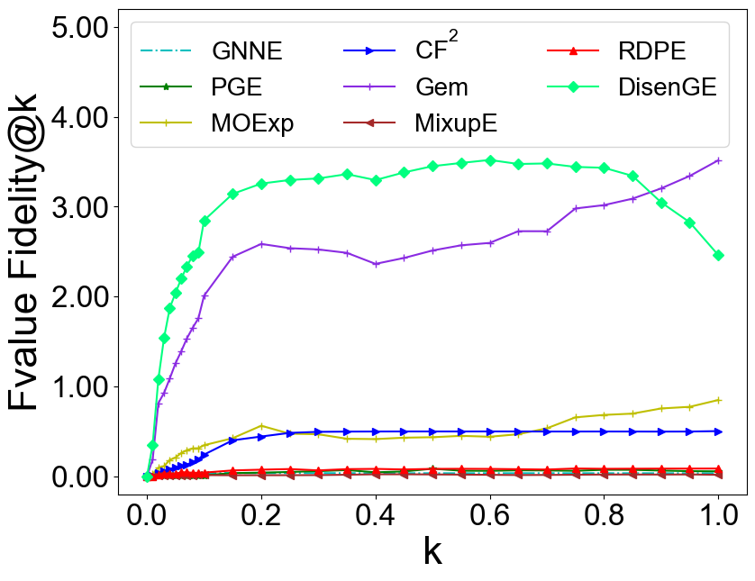
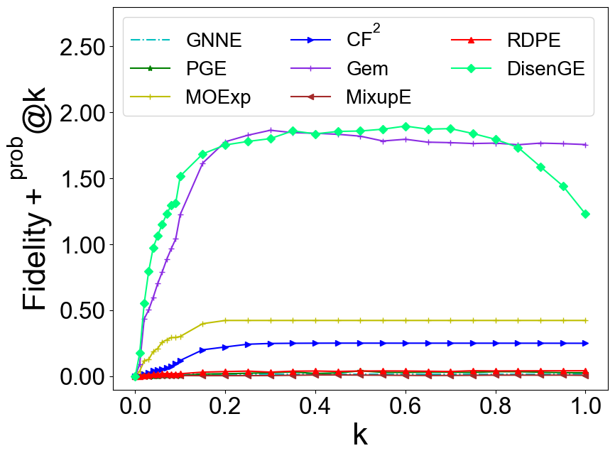
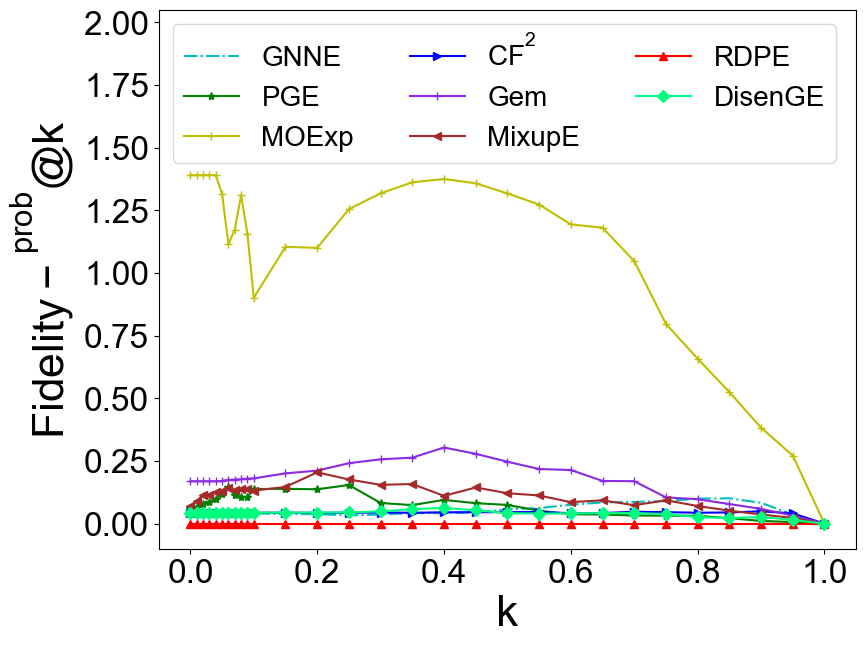
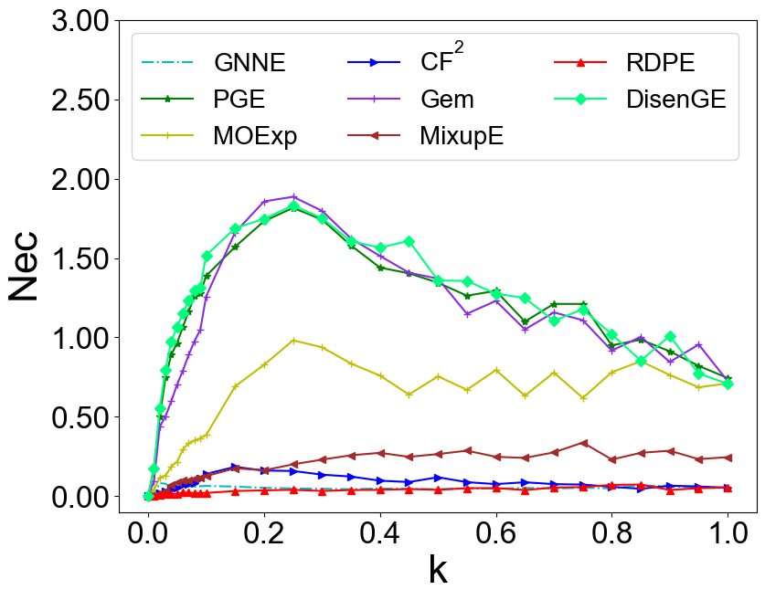
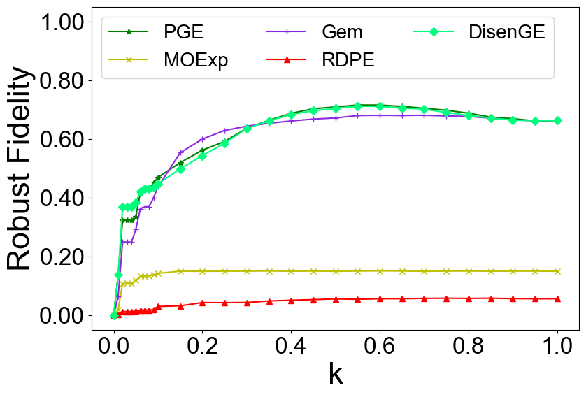

# DisenGE
Code for the paper "DisenGE: Learning Multiple Collaborative Subgraphs for Faithful Graph Neural Network Explanation"

## Overview
The project contains the following folders and files.
- codes
	- GNNmodels: Code for the GNN model to be explained.
 	- explain: Code for the disentangled Explainer.
	- load_dataset.py: Load datasets.
	- Configures.py: Parameter configuration of the GNN model to be explained.
	- metrics.py: Metrics of the evaluation.
	- plot_utils.py: Plot a diagram of a case for instance-level explanations.
- checkpoint: To facilitate the reproduction of the experimental results in the paper, we provide the trained GNNs to be explained in this fold.

## Prerequisites
- python >= 3.9
- torch >= 1.12.1+cu113
- torch-geometric >= 2.2.0

## To run
- Run train_GNNNets.py to train the GNNs to be explained. Change parameter **dataset** per demand.
- Run main.py to explain the pre-trained GNNs. Change **parameters** per demand.

## Additional Results
### Quantitative Performance Comparison on Alkane Carbonyl Datasets
We conducted additional experiments on the Alkane Carbonyl dataset. The experimental results are presented below. 

The target GNN consists of three GCN layers, each with a hidden dimension of 20. Node representations are $L_2$-normalized at each layer and activated by ReLU. The graph-level representation is obtained by concatenating max-pooling and mean-pooling readouts. The test accuracy is 0.982.

As can be seen, DisenGE achieves the best $\textit{Fvalue Fidelity}@k$ ($k < 0.85$), $\textit{NEC}$, and $\textit{Robust Fidelity}$, particularly under high sparsity ($k < 0.15$). Since the primary goal of GNN explanations is identifying the minimal predictive subset[1-2], DisenGE's superiority at small $k$ proves its ability to pinpoint critical substructures efficiently. Even at larger $k$, it consistently ranks in the top two.

Specifically, DisenGE's rapid early ascent on $Fidelity+^{prob}@k$ and $Nec$ demonstrates that it quickly extracts necessary components. Meanwhile, its consistently low $Fidelity-^{prob}@k$ at small $k$ ensures strong sufficiency without redundancy. For $\textit{Robust Fidelity}$, traditional baselines (e.g., GNNE, MixupE, $CF_2$, RDPE) collapse early, and MoE plateaus around $k=0.15$. In contrast, DisenGE ascends significantly faster than PGE and GEM in early sparse stages, ultimately stabilizing in the top tier.

[1] H. Yuan, H. Yu, S. Gui, S. Ji, Explainability in graph neural networks: A taxonomic survey, IEEE Transactions on Pattern Analysis and Machine Intelligence 45 (5) (2023) 5782–5799.

[2] Longa A, Azzolin S, Santin G, et al., Longa, A, Azzolin, S, Santin, G, Cencetti, G, Lio, P, Lepri, B, Passerini, A, Explaining the explainers in graph neural networks: a comparative study, ACM Computing Surveys 57.5 (2025): 1-37.

### Running cost and hardware
All experiments are conducted on a single NVIDIA RTX 3090 GPU (24 GB memory). 

##### Runtime comparison of different explainers on various datasets (in seconds)

| Explainer | Mutagenicity (Train / Test) | NCI1 (Train / Test) | PROTEINS (Train / Test) | BA-3Motifs (Train / Test) | Alkane Carbonyl (Train / Test) |
| :---: | :---: | :---: | :---: | :---: | :---: |
| **GNNExplainer** | -- / 8594.94 | -- / 13928.71 | -- / 3990.90 | -- / 15575.15 | -- / 4072.93 |
| **PGExplainer** | 740.83 / 278.11 | 1214.23 / 443.72 | 221.33 / 66.20 | 719.81 / 203.17 | 192.80 / 57.66 |
| **Gem** | 533.40 / 200.24 | 910.67 / 332.79 | 152.72 / 45.68 | 503.87 / 142.22 | 133.03 / 39.81 |
| **GNN-MOExp** | -- / 7252.81 | -- / 11408.50 | -- / 3445.80 | -- / 14279.58 | -- / 3376.73 |
| **CF2** | -- / 9595.87 | -- / 15274.39 | -- / 1429.38 | -- / 17531.11 | -- / 4528.89 |
| **MixupE** | 1513.62 / 187.97 | 1970.07 / 181.51 | 780.06 / 82.74 | 2518.15 / 268.30 | 679.49 / 72.09 |
| **RDPE** | 4561.34 / 160.72 | 10244.37 / 304.99 | 3686.81 / 82.77 | 14499.62 / 262.78 | 12426.78 / 457.24 |
| **DisenGE** | 9651.50 / 133.10 | 22816.38 / 554.57 | 6815.21 / 70.67 | 17248.27 / 207.49 | 4998.46 / 65.39 |

The below table reports the runtime (in seconds) of various post-hoc GNN explainers on five datasets. Non-parameterized explainers (GNNExplainer, GNN-MOExp, and CF$^2$) optimize a separate explanation for each graph at test time, leading to very high inference costs. Parameterized explainers (PGExplainer, Gem, MixupE, RDPE, and DisenGE) train a shared model that can be reused across graphs, resulting in much faster inference. While DisenGE requires more training time due to its multi-channel architecture, its inference speed matches other parameterized methods and vastly outperforms non-parameterized ones. Notably, on Mutagenicity, DisenGE takes only 133.10\,s for inference, the fastest among all methods, compared to 160.72\,s for RDPE, 187.97\,s for MixupE, and 8594.94\,s for GNNExplainer. Since training is a one-time cost while inference is performed repeatedly, this trade-off is acceptable in practice.

